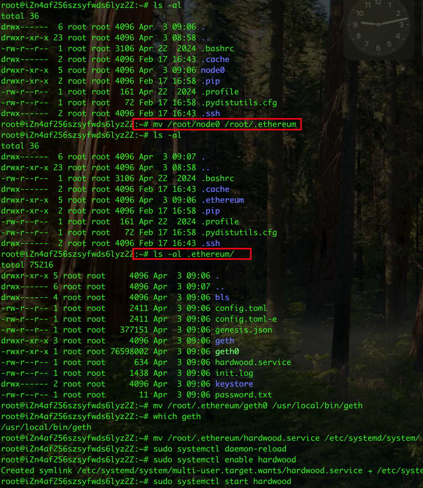
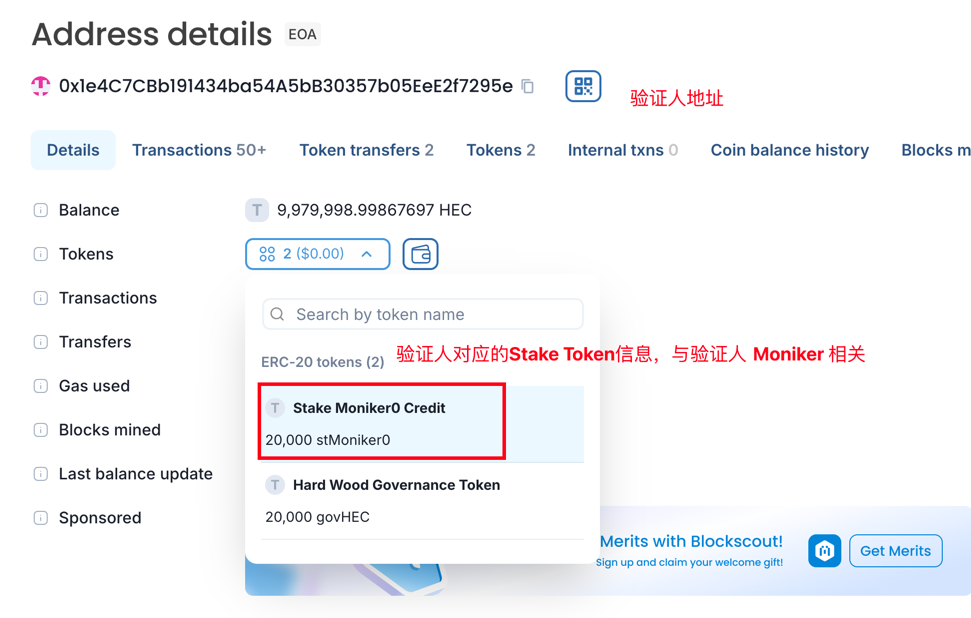

# 部署文档

## 创建服务器

### 创建部署服务（1台）

   * 系统: ubuntu 24.04.1 LTS
   * CPU: 4核8G
   * 系统盘(SSD): 20G

### 创建验证节点服务器（4台）

   ⚠️验证节点上有验证人私钥，节点出快时需要用到私钥签名，所以私钥是解锁状态，如果公开rpc（8545、8546端口），可能导致验证人资产损失，[官方也不推荐公开RPC](https://docs.bnbchain.org/bnb-smart-chain/validator/run-val/#3-start-validator-node)，
   所以，如果需要提供RPC服务，可以单独创建一个（不够了再加）full node节点，用于提供RPC服务，这样可以保证验证人私钥安全。

   * 系统: ubuntu 24.04.1 LTS
   * CPU: 2核4G
   * 系统盘(SSD): 20G
   * 数据盘(SSD): 50G，用于存储节点数据，方便扩容，将数据盘挂载到 /root/.ethereum 目录

## 在部署服务器上准备环境

> 注意⚠️：以下操作都是在部署服务器上执行

1. 将验证节点、full node节点的公钥添加到部署服务器的 `~/.ssh/authorized_keys` 文件中，同时在 `~/.ssh/config` 文件中配置服务器 ssh 登陆别名，例如：val-node-1、val-node-2 ...， full-node-1、full-node-2 ...

2. 安装 go

   ```shell
   wget https://go.dev/dl/go1.23.7.linux-amd64.tar.gz
   rm -rf /usr/local/go && tar -C /usr/local -xzf go1.23.7.linux-amd64.tar.gz
   echo "export PATH=\$PATH:/usr/local/go/bin" >> ~/.bashrc
   source ~/.bashrc
   go version # Should print "go version go1.23.7 linux/amd64".
   ```
3. 安装 nodejs

   ```shell
   curl -o- https://raw.githubusercontent.com/nvm-sh/nvm/v0.40.2/install.sh | bash
   \. "$HOME/.nvm/nvm.sh"
   nvm install 18
   node -v # Should print "v18.20.7".
   nvm current # Should print "v18.20.7".
   npm -v # Should print "10.8.2".
   ```

4. 安装 foundry

   > ⚠️可能需要在 `~/.bashrc` 文件中添加 PATH 配置，注意观察安装输出内容提示

   ```shell
   curl -L https://foundry.paradigm.xyz | bash
   foundryup --version
   foundryup
   forge --version
   ```
5. 安装 pipx

   > ⚠️可能需要在 `~/.bashrc` 文件中添加 PATH 配置，注意观察安装输出内容提示

   ```shell
   sudo apt update
   sudo apt install pipx
   pipx ensurepath
   pipx --version
   ```
   
6. 安装 poetry

   > ⚠️可能需要在 `~/.bashrc` 文件中添加 PATH 配置，注意观察安装输出内容提示   

   ```shell
   pipx install poetry
   poetry --version # Should print "Poetry 2.1.1".
   ```

## 编译 geth

   ```shell
   git clone https://github.com/bnb-chain/bsc.git 
   (cd bsc && git checkout v1.5.7 && make all)
   ```

## 部署验证人节点（也是full node节点）

1. 克隆部署仓库

   ```shell
   git clone https://github.com/web3debug/node-deploy.git
   cd node-deploy
   git checkout fork/main
   ```

2. 安装依赖

   ```shell
   sudo apt-get update
   sudo apt-get install python3.12-venv
   python3 -m venv venv
   source venv/bin/activate
   pip3 install -r requirements.txt
   ```

3. 将编译的 geth、bootnode 二进制拷贝到当前项目

   ```shell
   cp ../bsc/build/bin/geth ./bin/
   cp ../bsc/build/bin/bootnode ./bin/
   ./bin/geth version
   ```

4. 修改 .env 文件

   可修改变量，如果重新部署，从这里开始，不需要重新执行上面的步骤：
   
   * `VALIDATOR_SIZE` 验证节点数量
   * `VALIDATOR_IPS` 验证节点 IP 地址，多个节点用逗号分隔
   * `BLOCK_INTERVAL` 出块间隔
   * `KEYPASS` 验证人私钥密码，验证人私钥将自动生成，并备份在 keys 目录，注意保管好密码和私钥，密码长度必须大于 10 位
   * `INIT_HOLDERS` 初始地址，可以配置多个，持币数量在 `INIT_AMOUNT` 中配置
   * `INIT_AMOUNT` 初始地址持币 HEC 数量
   * `PROTECTOR` 链管理员地址，默认不分配 HEC，如果需要可以将地址配置在 `INIT_HOLDERS` 中
   
   > 说明：验证人地址初始分配 HEC 数量为 20010，其中 20001 将用于委托，剩余留作备用手续费

5. 生成 genesis 文件及节点配置文件

   * 如果是重新部署，清理旧数据
   ```shell
   make clear
   ```
   * 获取最新代码
   ```shell
   git pull
   ```
   * 创建验证人 keys，生成的文件在 `keys` 目录下，注意备份保管，同时会拷贝到 `.local` 文件中，之后会被拷贝到对应的验证人节点服务器上
   ```shell
   bash -x ./bsc_cluster.sh create_keys
   ```
   * 生成 genesis 文件
   ```shell
   bash -x ./bsc_cluster.sh create_genesis
   ```

   * 关闭 8545、8546 端口对外访问
   
   将 config 文件中的 `0.0.0.0` 修改为 `127.0.0.1`，例如：
   ```
   [Node]
   HTTPHost = "127.0.0.1"
   HTTPPort = 8545
   WSHost = "127.0.0.1"
   WSPort = 8546
   ```
   也可以通过修改服务器安全组

6. 将节点配置文件拷贝到对应的节点服务器上

   * 检查配置文件是否生成成功
   ```shell
   ls -al .local/bsc/node0/
   ```
   ```
   drwxr-xr-x 5 root root     4096 Apr  2 13:13 .
   drwxr-xr-x 3 root root     4096 Apr  2 13:13 ..
   drwx------ 4 root root     4096 Apr  2 13:12 bls
   -rw-r--r-- 1 root root     2446 Apr  2 13:13 config.toml
   -rw-r--r-- 1 root root   377147 Apr  2 13:13 genesis.json
   drwxr-xr-x 3 root root     4096 Apr  2 13:13 geth
   -rwxr-xr-x 1 root root 79675752 Apr  2 13:13 geth0
   -rw-r--r-- 1 root root      634 Apr  2 13:13 hardwood.service
   -rw-r--r-- 1 root root     1491 Apr  2 13:13 init.log
   drwx------ 2 root root     4096 Apr  2 13:12 keystore
   -rw-r--r-- 1 root root       11 Apr  2 13:12 password.txt
   ```
   
   * 拷贝节点配置文件到对应的节点服务器上

   ```shell
   scp -r ./.local/bsc/node0 val-node-1:
   scp -r ./.local/bsc/node1 val-node-2:
   scp -r ./.local/bsc/node2 val-node-3:
   scp -r ./.local/bsc/node3 val-node-4:
   ```

7. 启动验证节点

   节点启动使用 systemd 管理，服务器重启后会自动启动节点

   * 启动第一台验证人节点

   ```shell
   ssh val-node-1
   rm -rf /root/.ethereum/* # .ethereum 为挂载目录，如果存在，删除文件夹内所有数据
   mv /root/node0/* /root/.ethereum/ && rm -rf /root/node0
   mv /root/.ethereum/geth0 /usr/local/bin/geth
   mv /root/.ethereum/hardwood.service /etc/systemd/system/
   sudo systemctl daemon-reload
   sudo systemctl enable hardwood
   sudo systemctl start hardwood
   ```
   
   
   
   * 启动第二台验证人节点

   ```shell
   ssh val-node-2
   rm -rf /root/.ethereum/* # .ethereum 为挂载目录，如果存在，删除文件夹内所有数据
   mv /root/node1/* /root/.ethereum/ && rm -rf /root/node1
   mv /root/.ethereum/geth1 /usr/local/bin/geth
   mv /root/.ethereum/hardwood.service /etc/systemd/system/
   sudo systemctl daemon-reload
   sudo systemctl enable hardwood
   sudo systemctl start hardwood
   ```

   * 启动第三台验证人节点

   ```shell
   ssh val-node-3
   rm -rf /root/.ethereum/* # .ethereum 为挂载目录，如果存在，删除文件夹内所有数据
   mv /root/node2/* /root/.ethereum/ && rm -rf /root/node2
   mv /root/.ethereum/geth2 /usr/local/bin/geth
   mv /root/.ethereum/hardwood.service /etc/systemd/system/
   sudo systemctl daemon-reload
   sudo systemctl enable hardwood
   sudo systemctl start hardwood
   ```

   * 启动第四台验证人节点

   ```shell
   ssh val-node-4
   rm -rf /root/.ethereum/* # .ethereum 为挂载目录，如果存在，删除文件夹内所有数据
   mv /root/node3/* /root/.ethereum/ && rm -rf /root/node3
   mv /root/.ethereum/geth3 /usr/local/bin/geth
   mv /root/.ethereum/hardwood.service /etc/systemd/system/
   sudo systemctl daemon-reload
   sudo systemctl enable hardwood
   sudo systemctl start hardwood
   ```
   
   * 查看节点运行日志
   
   ```shell
   tail -f /root/.ethereum/bsc.log
   ```
   
   ```shell
   journalctl -u hardwood
   ```

   * 查看节点状态
   
   ```shell
   sudo systemctl status hardwood
   ```
   
   * 停止节点
   
   ```shell
   sudo systemctl stop hardwood
   ```

   * 重启节点
    
   ```shell
   sudo systemctl restart hardwood
   ```

8. 注册验证人信息
   
   下面是一个一个给验证人注册信息，这里可以根据需要修改每一位验证人的委托amount、moniker、identity、website、details信息。
   
   * amount 的单位已经成包含了18位的精度，例如：20001表示20001个HEC
   * moniker 必须设置，长度在 3-9 之间，第一个字符必须大写，只能包含字母、数字
   * identity 可以为空
   * website 可以为空，建议设置
   * details 可以为空，建议设置
   
   

   以下操作在部署服务器上执行，需要提前设置 RPC_URL 环境变量，IP 为任意一个验证人节点 IP 地址

   ```shell
   cd ./create-validator
   go mod download
   export RPC_URL=<ip>:8545
   ```   

   * 给第一个验证人注册信息
   
   ```shell
   go run ./main.go \
     --consensus-key-dir ./keys/validator0 \
     --vote-key-dir ./keys/bls0 \
     --password-path ./keys/password.txt \
     --amount 20001 \
     --validator-moniker "Moniker1" \
     --validator-identity "" \
     --validator-website "https://privatex.io" \
     --validator-details "first validator" \
     --rpc-url ${RPC_URL}
   ```
   
   * 给第二个验证人注册信息
   
   ```shell
   go run ./main.go \
     --consensus-key-dir ./keys/validator1 \
     --vote-key-dir ./keys/bls1 \
     --password-path ./keys/password.txt \
     --amount 20001 \
     --validator-moniker "Moniker2" \
     --validator-identity "" \
     --validator-website "https://privatex.io" \
     --validator-details "second validator" \
     --rpc-url ${RPC_URL}
   ```
   
   * 给第三个验证人注册信息
   
   ```shell
   go run ./main.go \
     --consensus-key-dir ./keys/validator2 \
     --vote-key-dir ./keys/bls2 \
     --password-path ./keys/password.txt \
     --amount 20001 \
     --validator-moniker "Moniker3" \
     --validator-identity "" \
     --validator-website "https://privatex.io" \
     --validator-details "third validator" \
     --rpc-url ${RPC_URL}
   ```

   * 给第四个验证人注册信息

   ```shell
   go run ./main.go \
     --consensus-key-dir ./keys/validator3 \
     --vote-key-dir ./keys/bls3 \
     --password-path ./keys/password.txt \
     --amount 20001 \
     --validator-moniker "Moniker4" \
     --validator-identity "" \
     --validator-website "https://privatex.io" \
     --validator-details "fourth validator" \
     --rpc-url ${RPC_URL}
   ```   

   * 如果还有更多验证人，将 `--consensus-key-dir` 和 `--vote-key-dir` 修改为对应的目录，然后执行上面的命令

9. 验证人节点创建完成

## 部署 archive node 节点

### 创建archive node 或 full node节点服务器（1台）

> 下面将以部署 archive 节点举例，提供给浏览器使用，根据需要可以部署多个 archive 或 full 节点

* 系统: ubuntu 24.04.1 LTS
* CPU: 8核8G
* 系统盘(SSD): 20G
* 数据盘(SSD): 100G，用于存储节点数据，方便扩容，将数据盘挂载到 /root/.ethereum 目录，可以使用好一点的ssd

### 在部署服务器上准备环境

1. 生成 archive node 节点配置文件

   先获取最新代码
   
   ```shell
   git pull
   ```   

   下面脚本参数说明：
      * 第一个参数表示节点编号，为第几台节点生成配置文件，节点编号从 0 开始
      * 第二个参数表示节点类型，archive 表示 archive node 节点，full 表示 full node 节点

   ```shell
   bash -x ./bsc_fullnode.sh 0 archive
   ```

2. 将节点配置文件拷贝到 archive node 服务器上

   先将生成的 `./.local/bsc/archive/node0/config.toml` 文件中 `HTTPHost` 修改为 `0.0.0.0` (应该需要对外提供服务)

   ```shell
   scp -r ./.local/bsc/archive/node0 archive-node-1:
   ```

3. 启动 archive node

   ```shell
   ssh archive-node-1
   rm -rf /root/.ethereum/* # .ethereum 为挂载目录，如果存在，删除文件夹内所有数据
   mv /root/node0/* /root/.ethereum/ && rm -rf /root/node0
   mv /root/.ethereum/geth0 /usr/local/bin/geth
   mv /root/.ethereum/hardwood.service /etc/systemd/system/
   sudo systemctl daemon-reload
   sudo systemctl enable hardwood
   sudo systemctl start hardwood
   ```

## 节点监控

metrics 监控默认以开启，可以使用 prometheus 收集节点服务器的 `http://<IP>:6060/debug/metrics/prometheus` 接口数据，每个数据所表示的含义可以google或问chatGPT

## 节点维护注意事项

* 定期检查服务器磁盘空间，及时清理日志文件（建议使用定时任务），日志文件保存在 `root/.ethereum/`，不要删除最新（看文件名）的日志文件及`bsc.log`，或者可以将日志等级调整为 `error` 级别
* 如果没有外部节点，验证人节点服务器最好不要暴露端口在公网上，特别是 8545、8546 端口，否则可能导致资产损失，如果有外部节点也只需要开放 p2p 端口 30311

## 测试网节点部署

> 在 `ecs-c2ea-xnode` 服务器上，服务器上的环境已经全部安装完成

* 获取最新代码

```shell
cd node-deploy
git pull
```

* 清理历史数据

```shell
make clear
```

* 重置节点，默认部署4个节点，如果需要自定，可以修改 `.env` 文件

```shell
make reset
```

* 检查节点允许状态

```shell
ps -ef | grep geth
tail -f .local/bsc/node0/bsc.log
```

* 启动节点，如果节点停止

```shell
make start
```


